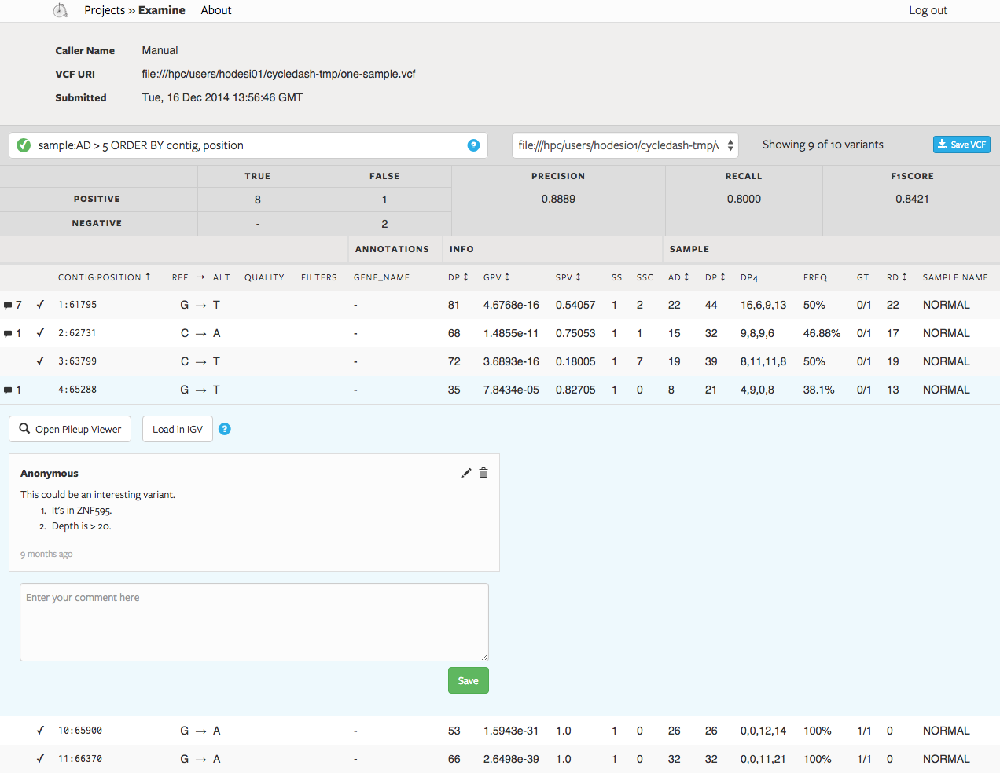

 

# Cycledash

Cycledash tracks runs of somatic variant callers on various (BAM) datasets and
provides an interface with which to inspect, analyze, debug, and improve the
resultant variant calls.

The primary feature of Cycledash is its "Examine Page" (screenshot above), which
allows users to quickly filter, order, and examine variants. A user can use a
SQL-like syntax to filter down to variants based on attributes of the genotype
(e.g. DP or GQ), their position in the genome (e.g. `X:1500000-3000000`), or
other annotations added by Cycledash workers (e.g. the gene a variant falls in).

We embed the [pileup.js](https://github.com/hammerlab/pileup.js) pileup viewer within
this page, allowing users to explore the pileup at a variant's location.

## How We Use Cycledash

At [Hammerlab](https://github.com/hammerlab) we're using Cycledash to help us
improve our distributed somatic variant caller,
[Guacamole](https://github.com/hammerlab/guacamole).

Our workflow is:

1. [Ketrew](https://github.com/hammerlab/ketrew), our workflow engine, starts a
   Guacamole job.
2. When the job is complete, the resulting VCF and metadata is posted via a JSON
   RESTful interface to Cycledash.
3. Cycledash processes the VCFs and presents them in an easy-to-navigate
   interface (found in the screenshot, above).
4. If a validation VCF is posted with the main VCF, Cycledash calculates
   statistics like precision and recall.

Cycledash can also be used by researchers interested in quickly browsing VCFs
for variants of interest.

## Developing Cycledash

Cycledash is a Python [Flask](http://flask.pocoo.org/) app with a
[React.js](http://facebook.github.io/react/) frontend. We use
[PostgreSQL](http://www.postgresql.org/) as our database, and use a worker queue
to execute longer-running tasks such as importing VCFs into Postgres or
annotating variants with gene names.

More information about developing Cycledash can be found in the
[DEVELOP.md](/DEVELOP.md) file in this repository.

## Deploying Cycledash

For a quick, barebones deployment, follow the [develop instructions](/DEVELOP.md).

For a more robust deployment, we use:

1. [gunicorn](http://gunicorn.org/) (so that many server processes may run at
   once)
2. [unicornherder](https://github.com/gds-operations/unicornherder)
3. [Upstart](http://upstart.ubuntu.com/) to keep things up and running.
4. [nginx](http://nginx.org/) acts as a reverse proxy and serves (and manages
   cache headers for) our static assets.

## Issues/Features/Bugs

We welcome bug reports and feature requests, and handle them through GitHub's
issue tracker.

Please search our [GitHub issues](https://github.com/hammerlab/cycledash/issues)
before filing an issue.

## Basic JSON API

You can find documentation at /about on a running Cycledash instance, or at
[API.md](/API.md).
